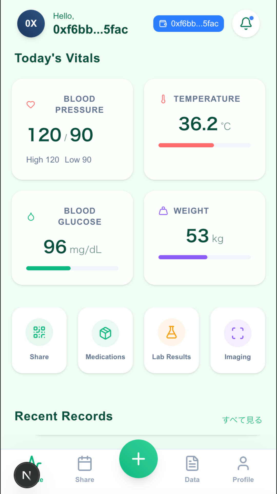

<div align="center">
  
  <h1>🌍💊 CurePocket</h1>
  <h3>Your Global Health Passport on Sui / 世界中どこでも使えるヘルスパスポート</h3>

  <p>
    <strong>Secure. Private. Portable.</strong><br>
    Built with 💧 <strong>Sui</strong> | 🦭 <strong>Walrus</strong> | 🔐 <strong>Seal</strong>
  </p>

  <p>
    <a href="#-about-the-project">About</a> •
    <a href="#-key-features">Features</a> •
    <a href="#-try-demo">Try Demo</a> •
    <a href="#-architecture">Architecture</a> •
    <a href="#-team">Team</a>
  </p>

  <a href="https://cure-pocket.pages.dev">
    
  </a>
</div>

---

## 📖 About The Project

### 🇬🇧 English
**CurePocket** is a privacy-first personal health passport designed to solve the fragmentation of medical data.
Born from the real-world experience of a **practicing pharmacist**, it addresses critical issues like forgotten medication history, lost lab results, and the inability to share health data across borders.

By leveraging **Sui** for ownership, **Walrus** for decentralized storage, and **Seal** for encryption, CurePocket empowers patients to own their health data and share it securely—only when they want to.

### 🇯🇵 日本語
**CurePocket（キュアポケット）** は、医療データの分断を解消するために設計された、プライバシーファーストの個人用ヘルスパスポートです。
**現役薬剤師**の実体験から生まれたこのプロジェクトは、「お薬手帳の持参忘れ」「検査結果の紛失」「海外渡航時の医療情報共有の難しさ」といった現場の課題を解決します。

**Sui** による所有権管理、**Walrus** による分散ストレージ、**Seal** による暗号化技術を組み合わせることで、患者自身が自分の健康データを管理し、必要な相手にのみ安全に共有できる世界を実現します。

---

## ✨ Key Features

### 🔐 Privacy & Security (プライバシーとセキュリティ)
- **Patient-Owned Encryption:** All medical data (Prescriptions, X-rays, Lab results) is encrypted using **Seal**. Only the patient holds the decryption keys.
  - 全ての医療データは **Seal** で暗号化されます。復号鍵を持つのは患者本人だけです。
- **Decentralized Storage:** Large files like MRI/CT scans are stored on **Walrus**, ensuring data permanence and privacy without centralized servers.
  - MRIやCTなどの大容量ファイルは **Walrus** に保存され、サーバーレスで永続性と秘匿性を確保します。

### 📱 Mobile-First Experience (モバイルファースト体験)
- **Pocket-Sized Health:** Access your entire medical history from a smartphone. Simple UI designed for non-tech-savvy patients.
  - スマホひとつで全ての病歴にアクセス。ITに詳しくない患者さんでも使える直感的なデザインです。
- **AI-Powered OCR:** Instantly digitize paper prescriptions and lab reports using the camera.
  - カメラで撮影するだけで、紙の処方箋や検査結果を **AI OCR** が自動でデジタル化します。
- **QR Code Sharing:** Share temporary access to doctors instantly via QR code (e.g., in emergencies or travel).
  - 緊急時や旅行先でも、QRコードを見せるだけで医師に一時的なアクセス権を付与できます。

### 🆔 Sui Medical Passport (Sui メディカルパスポート)
- **SBT Identity:** A Soulbound Token (SBT) on Sui acts as your immutable health identity.
  - Sui上の譲渡不可トークン（SBT）が、改ざん不可能な医療IDとして機能します。
- **Interoperability:** Built with global standards (FHIR/ATC) in mind for cross-border usage.
  - 国際標準（FHIR/ATC）を意識した設計で、国境を超えたデータ連携を目指します。

---

## 🚀 Try Demo

Experience the live application directly in your browser.
ブラウザですぐに動作するデモをお試しいただけます。

### 👉 **[https://cure-pocket.pages.dev](https://cure-pocket.pages.dev)**

> **Note:** Requires a Sui Wallet connection.<br>
> **注意:** ご利用にはSui Walletの接続が必要です。

---

## 🏗 Architecture

The system consists of three core layers: **Sui (Identity & Logic)**, **Walrus (Storage)**, and **Seal (Encryption)**.

```mermaid
graph TD
    User["User (Patient/Doctor)"] -->|UI Interaction| Frontend["Next.js App"]
    
    subgraph "🔐 Security & Storage Layer"
        Frontend -->|Encrypt/Decrypt| Seal["Seal Service"]
        Frontend -->|Store/Fetch Encrypted Blob| Walrus["Walrus Storage"]
        Seal -.->|Key Management| User
    end

    subgraph "⛓️ On-Chain Layer (Sui)"
        Frontend -->|Transaction| Sui["Sui Blockchain"]
        Sui -->|Ownership| SBT["Medical Passport SBT"]
        SBT -->|Reference| DF["Dynamic Fields"]
        DF -.->|Link to| Walrus
    end
````

### Data Flow

1.  **Upload:** User uploads data (e.g., X-ray). -\> Encrypted by **Seal**. -\> Stored on **Walrus**.
2.  **Registry:** The Blob ID from Walrus is registered to the user's **Sui SBT** as a dynamic field.
3.  **Share:** User generates a temporary decryption key via Seal and shares it (QR/Link) with the doctor.

-----

## 🛠 Tech Stack

| Category | Technology | Usage |
|---|---|---|
| **Blockchain** | **Sui (Move)** | SBT, Access Control, Dynamic Fields |
| **Storage** | **Walrus** | Encrypted Medical Data (JSON, Images, PDF) |
| **Security** | **Seal** | TEE-based Key Management & Encryption |
| **Frontend** | **Next.js / TypeScript** | Mobile-first PWA, Wallet Integration |
| **AI** | **Google Gemini / OCR** | Prescription & Lab Result digitization |

-----

## 👥 Team Unagi Labs

We are a team of builders bridging the gap between **Healthcare** and **Web3**.

  - **Shizuku** (Lead / Pharmacist): Product Design, Medical Domain Expert.
  - **Butasan** (Lead Engineer): Sui Move, System Architecture, Security.

-----

\<div align="center"\>
\<p\>Made with ❤️ for a healthier decentralized world.\</p\>
\</div\>