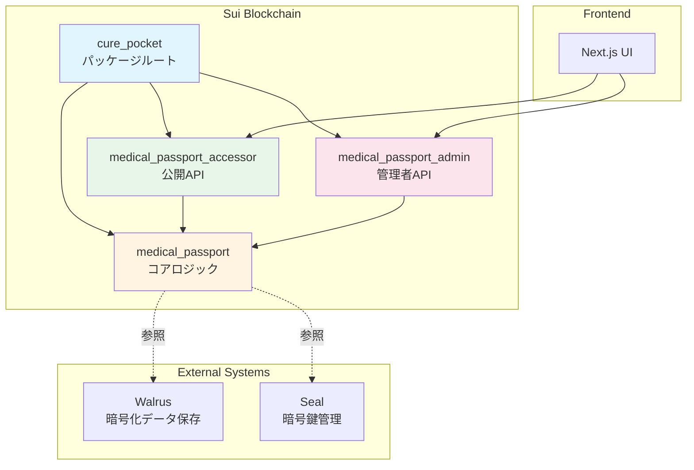
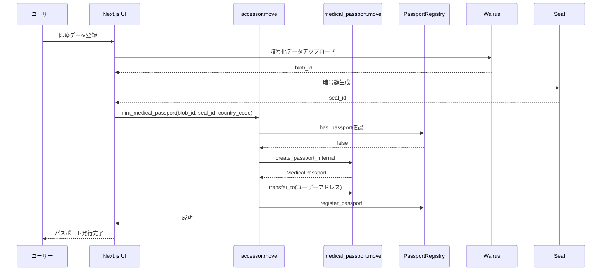
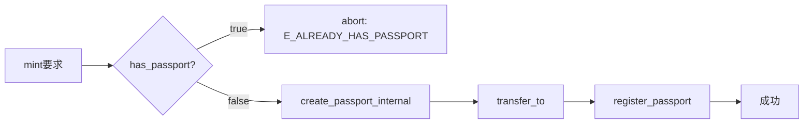
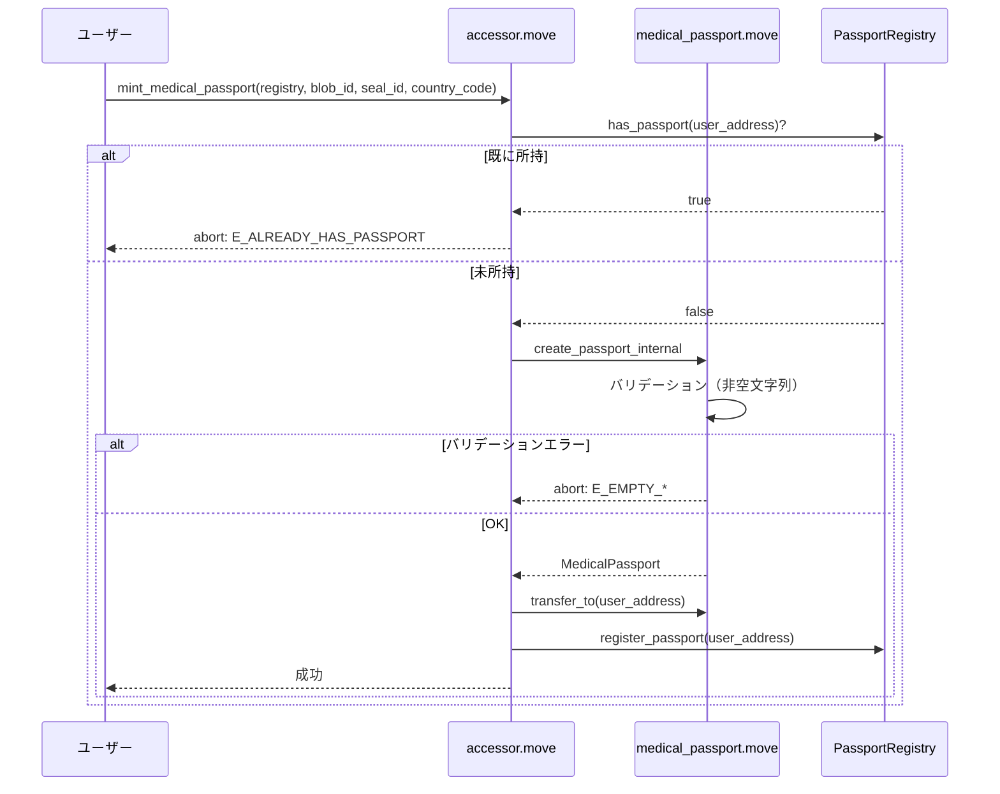
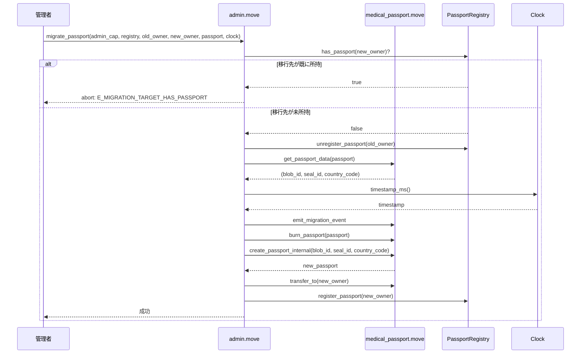

# Cure Pocket - Medical Passport SBT スマートコントラクト要件定義書

**バージョン**: v1.0
**最終更新**: 2025-11-18
**ステータス**: 実装済み（コア機能）

---

## 目次

1. [プロジェクト概要](#1-プロジェクト概要)
2. [システムアーキテクチャ](#2-システムアーキテクチャ)
3. [データ構造仕様](#3-データ構造仕様)
4. [機能要件](#4-機能要件)
5. [非機能要件](#5-非機能要件)
6. [API仕様](#6-api仕様)
7. [エラーコード](#7-エラーコード)
8. [バリデーション・制約条件](#8-バリデーション制約条件)
9. [テスト仕様](#9-テスト仕様)
10. [実装済み機能](#10-実装済み機能)
11. [今後の拡張計画](#11-今後の拡張計画)
12. [変更履歴](#12-変更履歴)

---

## 1. プロジェクト概要

### 1.1 ビジョン

Cure Pocketは、**世界中どこでも使える個人用ヘルスパスポートシステム**です。

薬・検査値・レントゲン画像・手術歴・アレルギー・病歴などの医療情報を暗号化してWalrusに保存し、Sui上のSBT（Soulbound Token）で所有権を管理する分散型ヘルスデータ基盤を提供します。

### 1.2 技術スタック

| レイヤー | 技術 | 用途 |
|---------|------|------|
| **ブロックチェーン** | Sui（Move言語） | 所有権管理、アクセス制御 |
| **ストレージ** | Walrus | 暗号化医療データ保存 |
| **暗号化** | Seal | 暗号鍵管理、アクセス制御 |
| **フロントエンド** | Next.js 16 + TypeScript | ユーザーインターフェース |

### 1.3 主要特性

- **Soulbound（譲渡不可）**: パスポートは発行後、譲渡できない
- **1ウォレット1枚制約**: 1つのウォレットアドレスに対して1枚のみ
- **プライバシー保護**: 医療データはオフチェーン暗号化保存
- **グローバル対応**: 国際標準準拠（ISO 3166-1 alpha-2）
- **回復可能**: ウォレット紛失時の管理者による移行機能

---

## 2. システムアーキテクチャ

### 2.1 モジュール構成



### 2.2 Move 2024準拠設計（AGENTS.md）

| モジュール | ファイル | 責務 | 可視性スコープ |
|-----------|---------|------|---------------|
| **cure_pocket** | `cure_pocket.move` | パッケージ初期化、AdminCap管理 | パッケージルート |
| **medical_passport** | `medical_passport.move` | コアロジック、データ構造定義 | 内部実装（`public(package)`） |
| **medical_passport_accessor** | `accessor.move` | 公開API（getter、mint） | 外部インターフェース（`public`、`entry`） |
| **medical_passport_admin** | `admin.move` | 管理者専用操作（管理mint、移行） | 管理者API（`public`） |

**設計原則**:
- すべての`public fun`と`entry fun`は`accessor.move`に集約
- AdminCap必須の操作は`admin.move`に分離
- 内部ロジックは`medical_passport.move`に集約し、`public(package)`スコープで管理
- `public(friend)`は使用しない（Move 2024非推奨）

### 2.3 データフロー



---

## 3. データ構造仕様

### 3.1 MedicalPassport（医療パスポートSBT）

```move
public struct MedicalPassport has key {
    id: object::UID,
    walrus_blob_id: String,
    seal_id: String,
    country_code: String,
}
```

#### フィールド仕様

| フィールド | 型 | 説明 | 制約 |
|-----------|----|----|------|
| `id` | `object::UID` | Suiオブジェクト識別子 | 自動生成 |
| `walrus_blob_id` | `String` | Walrus上の暗号化医療データID | 非空文字列 |
| `seal_id` | `String` | Seal暗号化システムの鍵/ポリシーID | 非空文字列 |
| `country_code` | `String` | 発行国コード（ISO 3166-1 alpha-2） | 非空文字列（例: "JP", "US"） |

#### Soulbound実装の仕組み

**特性**: `has key`のみ（`has store`なし）

```move
// 以下の関数は存在しない（コンパイルエラー）
public fun transfer(passport: MedicalPassport, recipient: address)
```

**譲渡不可の保証**:
1. `has store`能力を持たないため、`sui::transfer::public_transfer()`で転送不可
2. `transfer_to()`関数は`public(package)`スコープのため、モジュール外から呼び出し不可
3. この2つの制約により、mint後は所有者以外に譲渡できない

---

### 3.2 PassportRegistry（1ウォレット1枚制約管理）

```move
public struct PassportRegistry has key {
    id: object::UID,
}
```

#### 役割

- **共有オブジェクト**（shared object）として1つだけ存在
- Dynamic Fieldsで`address -> PassportMarker`の対応を管理
- すべてのmint操作は`&mut PassportRegistry`を受け取る

#### 制約保証の仕組み



**競合防止**:
- 共有オブジェクトの`&mut`参照により、同時mint時の競合を防止
- `has_passport()`で既存チェック、`register_passport()`で登録
- 同じアドレスへの二重mintは`E_ALREADY_HAS_PASSPORT`でabort

---

### 3.3 PassportMarker（所有マーカー）

```move
public struct PassportMarker has store, drop {}
```

#### 用途

- Dynamic Fieldの値として使用
- `address -> PassportMarker`の対応で「このアドレスは既にパスポートを持っている」を記録
- 空の構造体（マーカーとしての役割のみ）

#### Dynamic Fields設計

```
PassportRegistry.id (UID)
  |-- [address1] -> PassportMarker {}
  |-- [address2] -> PassportMarker {}
  +-- [address3] -> PassportMarker {}
```

---

### 3.4 AdminCap（管理者権限）

```move
public struct AdminCap has key, store {
    id: object::UID
}
```

#### 特性

- `has key, store`を持つため**譲渡可能**
- パッケージデプロイ時に1つ生成され、デプロイヤーに付与
- 所有していること自体が権限の証明となる

#### 初期化フロー

```move
fun init(ctx: &mut tx_context::TxContext) {
    // AdminCap を生成してデプロイヤーに転送
    let admin = AdminCap {
        id: object::new(ctx)
    };
    sui::transfer::public_transfer(admin, tx_context::sender(ctx));

    // PassportRegistry を生成して共有オブジェクトとして公開
    medical_passport::create_and_share_passport_registry(ctx);
}
```

---

### 3.5 PassportMigrationEvent（移行イベント）

```move
public struct PassportMigrationEvent has copy, drop {
    old_owner: address,
    new_owner: address,
    passport_id: object::ID,
    walrus_blob_id: String,
    timestamp_ms: u64,
}
```

#### フィールド仕様

| フィールド | 型 | 説明 |
|-----------|----|----|
| `old_owner` | `address` | 移行元ウォレットアドレス |
| `new_owner` | `address` | 移行先ウォレットアドレス |
| `passport_id` | `object::ID` | 移行されたパスポートのオブジェクトID |
| `walrus_blob_id` | `String` | 継承されたWalrus blob ID |
| `timestamp_ms` | `u64` | 移行実行時刻（Unix timestamp, ミリ秒） |

#### 用途

- 管理者によるパスポート移行の記録
- 監査証跡（audit trail）として使用
- オフチェーンでの移行履歴追跡

---

## 4. 機能要件

### FR-1: パスポート発行（Mint）

**要件ID**: FR-1
**優先度**: Critical
**ステータス**: 実装済み

#### 概要

ユーザーが自身の医療パスポートSBTを発行できる機能。

#### 詳細要件

- **FR-1.1**: 誰でもセルフmintできる（AdminCap不要）
- **FR-1.2**: 1ウォレット1枚まで（二重mint禁止）
- **FR-1.3**: 必須フィールド: `walrus_blob_id`, `seal_id`, `country_code`（すべて非空文字列）
- **FR-1.4**: mint後のパスポートはSoulbound（譲渡不可）
- **FR-1.5**: mint後のパスポートはユーザーアドレスに自動転送

#### 動作フロー



#### 受け入れ基準

- ユーザーは1回のみmint可能
- 二重mintは`E_ALREADY_HAS_PASSPORT`でabort
- 空文字列は`E_EMPTY_*`でabort
- mint後のパスポートは譲渡不可
- mint後のパスポートはユーザー所有

---

### FR-2: パスポート照会（Getter）

**要件ID**: FR-2
**優先度**: High
**ステータス**: 実装済み

#### 概要

パスポートのフィールド情報を照会できる機能。

#### 詳細要件

- **FR-2.1**: 個別フィールド取得（`walrus_blob_id`, `seal_id`, `country_code`）
- **FR-2.2**: 一括フィールド取得（`get_all_fields`）
- **FR-2.3**: 所有状態確認（`has_passport`）
- **FR-2.4**: すべてのgetter関数はimmutable参照で動作

#### API一覧

| 関数名 | 戻り値 | 用途 |
|--------|--------|------|
| `get_walrus_blob_id` | `&String` | Walrus blob ID取得 |
| `get_seal_id` | `&String` | Seal ID取得 |
| `get_country_code` | `&String` | 国コード取得 |
| `get_all_fields` | `(&String, &String, &String)` | 全フィールド一括取得 |
| `has_passport` | `bool` | 所有状態確認 |

#### 受け入れ基準

- getter関数はパスポートの状態を変更しない
- `has_passport`は正確な所有状態を返す
- 参照のライフタイムが適切に管理される

---

### FR-3: パスポート移行（Migration）

**要件ID**: FR-3
**優先度**: High
**ステータス**: 実装済み

#### 概要

ウォレット紛失時に、管理者がパスポートを新しいウォレットに移行できる機能。

#### 詳細要件

- **FR-3.1**: AdminCapを持つ管理者のみ実行可能
- **FR-3.2**: 移行先はパスポート未所持であること
- **FR-3.3**: データ継承（`walrus_blob_id`, `seal_id`, `country_code`）
- **FR-3.4**: 移行元のパスポートは削除（burn）
- **FR-3.5**: 移行イベントを発行（監査証跡）
- **FR-3.6**: マーカーの原子的更新（移行元削除、移行先登録）

#### 動作フロー



#### 受け入れ基準

- AdminCapなしでは実行不可
- 移行先が既にパスポート所持の場合はabort
- データは完全に継承される
- 移行元のパスポートは削除される
- 移行イベントが正しく発行される
- マーカーが正しく更新される

---

### FR-4: 権限管理（AdminCap）

**要件ID**: FR-4
**優先度**: High
**ステータス**: 実装済み

#### 概要

管理者権限を管理する機能。

#### 詳細要件

- **FR-4.1**: AdminCapはデプロイ時に1つ生成
- **FR-4.2**: AdminCapはデプロイヤーに付与
- **FR-4.3**: AdminCapは譲渡可能（`has key, store`）
- **FR-4.4**: AdminCapを必要とする操作は`admin.move`に集約

#### 受け入れ基準

- デプロイ時にAdminCapが生成される
- AdminCapはデプロイヤーが所有
- AdminCapは譲渡可能
- AdminCapなしでは管理者操作は実行不可

---

## 5. 非機能要件

### NFR-1: セキュリティ

**要件ID**: NFR-1
**優先度**: Critical
**ステータス**: 実装済み

#### 詳細要件

- **NFR-1.1**: Soulbound特性（パスポートは譲渡不可）
- **NFR-1.2**: 1ウォレット1枚制約（PassportRegistryで管理）
- **NFR-1.3**: AdminCap必須の管理者操作（権限チェック）
- **NFR-1.4**: バリデーション（非空文字列チェック）

#### 実装方法

| 要件 | 実装方法 |
|------|---------|
| Soulbound | `has store`なし、`transfer_to()`は`public(package)` |
| 1ウォレット1枚 | PassportRegistry + Dynamic Fields + 共有オブジェクト |
| AdminCap | 関数引数で`&AdminCap`を要求 |
| バリデーション | `create_passport_internal()`で非空チェック |

---

### NFR-2: データ整合性

**要件ID**: NFR-2
**優先度**: Critical
**ステータス**: 実装済み

#### 詳細要件

- **NFR-2.1**: すべてのフィールドは非空文字列
- **NFR-2.2**: PassportRegistryは共有オブジェクト（競合防止）
- **NFR-2.3**: 移行時はマーカーの原子的更新（削除→登録）
- **NFR-2.4**: イベント発行による追跡可能性

---

### NFR-3: 監査性

**要件ID**: NFR-3
**優先度**: High
**ステータス**: 実装済み

#### 詳細要件

- **NFR-3.1**: 移行イベント発行（オフチェーン追跡可能）
- **NFR-3.2**: タイムスタンプ記録（Unix timestamp, ミリ秒）
- **NFR-3.3**: 移行元/移行先アドレス記録
- **NFR-3.4**: パスポートID記録

---

### NFR-4: Move 2024準拠

**要件ID**: NFR-4
**優先度**: High
**ステータス**: 実装済み

#### 詳細要件

- **NFR-4.1**: 可視性ルール遵守（`public`, `public(package)`, `entry`）
- **NFR-4.2**: ファイルベース関数配置（AGENTS.md準拠）
- **NFR-4.3**: `public(friend)`非使用（Move 2024非推奨）

---

## 6. API仕様

### 6.1 Public API（accessor.move）

#### 6.1.1 mint_medical_passport（エントリー関数）

```move
entry fun mint_medical_passport(
    registry: &mut PassportRegistry,
    walrus_blob_id: String,
    seal_id: String,
    country_code: String,
    ctx: &mut tx_context::TxContext
)
```

| 項目 | 内容 |
|------|------|
| **権限** | 誰でも呼び出し可能（AdminCap不要） |
| **制約** | 1ウォレット1枚まで |
| **引数** | `registry`: 共有PassportRegistry<br/>`walrus_blob_id`: Walrus blob ID（非空）<br/>`seal_id`: Seal ID（非空）<br/>`country_code`: 国コード（非空） |
| **戻り値** | なし（entryなのでvoid） |
| **副作用** | パスポート作成<br/>tx送信者に転送<br/>Registryに登録 |
| **エラー** | `E_ALREADY_HAS_PASSPORT (4)`: 既に所持<br/>`E_EMPTY_WALRUS_BLOB_ID (1)`: blob_idが空<br/>`E_EMPTY_SEAL_ID (2)`: seal_idが空<br/>`E_EMPTY_COUNTRY_CODE (3)`: country_codeが空 |

**使用例（PTB）**:
```typescript
tx.moveCall({
  target: `${PACKAGE_ID}::medical_passport_accessor::mint_medical_passport`,
  arguments: [
    tx.object(PASSPORT_REGISTRY_ID),
    tx.pure.string("walrus_blob_abc123"),
    tx.pure.string("seal_xyz789"),
    tx.pure.string("JP"),
  ],
});
```

---

#### 6.1.2 Getter関数群

##### get_walrus_blob_id

```move
public fun get_walrus_blob_id(passport: &MedicalPassport): &String
```

| 項目 | 内容 |
|------|------|
| **権限** | 誰でも呼び出し可能 |
| **引数** | `passport`: MedicalPassportへのimmutable参照 |
| **戻り値** | Walrus blob IDへの参照 |

---

##### get_seal_id

```move
public fun get_seal_id(passport: &MedicalPassport): &String
```

| 項目 | 内容 |
|------|------|
| **権限** | 誰でも呼び出し可能 |
| **引数** | `passport`: MedicalPassportへのimmutable参照 |
| **戻り値** | Seal IDへの参照 |

---

##### get_country_code

```move
public fun get_country_code(passport: &MedicalPassport): &String
```

| 項目 | 内容 |
|------|------|
| **権限** | 誰でも呼び出し可能 |
| **引数** | `passport`: MedicalPassportへのimmutable参照 |
| **戻り値** | 国コードへの参照 |

---

##### get_all_fields

```move
public fun get_all_fields(passport: &MedicalPassport): (&String, &String, &String)
```

| 項目 | 内容 |
|------|------|
| **権限** | 誰でも呼び出し可能 |
| **引数** | `passport`: MedicalPassportへのimmutable参照 |
| **戻り値** | `(walrus_blob_id, seal_id, country_code)`のタプル |

---

##### has_passport

```move
public fun has_passport(registry: &PassportRegistry, owner: address): bool
```

| 項目 | 内容 |
|------|------|
| **権限** | 誰でも呼び出し可能 |
| **引数** | `registry`: PassportRegistryへのimmutable参照<br/>`owner`: 確認対象のアドレス |
| **戻り値** | `true`: 所持、`false`: 未所持 |

---

### 6.2 Admin API（admin.move）

#### 6.2.1 mint_medical_passport（管理者mint）

```move
public fun mint_medical_passport(
    _admin: &AdminCap,
    registry: &mut PassportRegistry,
    walrus_blob_id: String,
    seal_id: String,
    country_code: String,
    ctx: &mut tx_context::TxContext
)
```

| 項目 | 内容 |
|------|------|
| **権限** | AdminCapを所有している者のみ |
| **機能** | accessor.moveのmintと同じだが、管理者権限が必要 |

---

#### 6.2.2 migrate_passport（パスポート移行）

```move
public fun migrate_passport(
    _admin: &AdminCap,
    registry: &mut PassportRegistry,
    old_owner: address,
    new_owner: address,
    passport: MedicalPassport,
    clock: &Clock,
    ctx: &mut tx_context::TxContext
)
```

| 項目 | 内容 |
|------|------|
| **権限** | AdminCapを所有している者のみ |
| **用途** | ウォレット紛失時のパスポート移行 |
| **引数** | `_admin`: AdminCapへの参照（権限証明）<br/>`registry`: 共有PassportRegistry<br/>`old_owner`: 移行元アドレス<br/>`new_owner`: 移行先アドレス<br/>`passport`: 移行対象パスポート<br/>`clock`: Sui Clock（タイムスタンプ取得） |
| **戻り値** | なし |
| **副作用** | 移行元マーカー削除<br/>元パスポート削除<br/>新パスポート作成<br/>新パスポート転送<br/>移行先マーカー登録<br/>移行イベント発行 |
| **エラー** | `E_MIGRATION_TARGET_HAS_PASSPORT (5)`: 移行先が既に所持 |

**動作フロー詳細**:
1. 移行先の状態チェック（`has_passport`）
2. 移行元の所有マーカーを削除（`unregister_passport`）
3. パスポートデータを取得（`get_passport_data`）
4. 移行イベントを構築・発行（`emit_migration_event`）
5. 元のパスポートを削除（`burn_passport`）
6. 同じデータで新しいパスポートを作成（`create_passport_internal`）
7. 新しいパスポートを移行先に転送（`transfer_to`）
8. 移行先の所有マーカーを登録（`register_passport`）

---

### 6.3 Internal API（medical_passport.move）

**スコープ**: `public(package)`（パッケージ内部のみ）

#### 6.3.1 create_passport_internal

```move
public(package) fun create_passport_internal(
    walrus_blob_id: String,
    seal_id: String,
    country_code: String,
    ctx: &mut tx_context::TxContext
): MedicalPassport
```

| 項目 | 内容 |
|------|------|
| **用途** | パスポート作成（バリデーション込み） |
| **バリデーション** | `walrus_blob_id`非空チェック<br/>`seal_id`非空チェック<br/>`country_code`非空チェック |
| **戻り値** | 新しい`MedicalPassport` |

---

#### 6.3.2 transfer_to

```move
public(package) fun transfer_to(passport: MedicalPassport, recipient: address)
```

| 項目 | 内容 |
|------|------|
| **用途** | パスポート転送（内部専用） |
| **Soulbound保証** | `public(package)`により外部から呼び出し不可 |

---

#### 6.3.3 Registry操作

```move
public(package) fun create_and_share_passport_registry(ctx: &mut tx_context::TxContext)
public(package) fun has_passport(registry: &PassportRegistry, owner: address): bool
public(package) fun register_passport(registry: &mut PassportRegistry, owner: address)
public(package) fun unregister_passport(registry: &mut PassportRegistry, owner: address)
```

---

#### 6.3.4 移行サポート

```move
public(package) fun get_passport_data(passport: &MedicalPassport): (String, String, String)
public(package) fun burn_passport(passport: MedicalPassport)
public(package) fun emit_migration_event(
    old_owner: address,
    new_owner: address,
    passport_id: object::ID,
    walrus_blob_id: String,
    timestamp_ms: u64
)
```

---

#### 6.3.5 エラーコードゲッター

```move
public(package) fun e_already_has_passport(): u64
public(package) fun e_migration_target_has_passport(): u64
```

---

## 7. エラーコード

### 7.1 エラーコード一覧

| コード | 定数名 | 説明 | 発生条件 | 対処方法 |
|-------|--------|------|---------|---------|
| **1** | `E_EMPTY_WALRUS_BLOB_ID` | Walrus blob IDが空文字列 | mint時に`walrus_blob_id`が空 | 有効なblob IDを指定 |
| **2** | `E_EMPTY_SEAL_ID` | Seal IDが空文字列 | mint時に`seal_id`が空 | 有効なseal IDを指定 |
| **3** | `E_EMPTY_COUNTRY_CODE` | 国コードが空文字列 | mint時に`country_code`が空 | 有効な国コード（例: "JP"）を指定 |
| **4** | `E_ALREADY_HAS_PASSPORT` | 既にパスポートを所持している | 同じアドレスが2回mint | 既存パスポートを使用 |
| **5** | `E_MIGRATION_TARGET_HAS_PASSPORT` | 移行先が既にパスポートを所持 | 移行先アドレスが既に所持 | 別のアドレスに移行 |

### 7.2 エラーハンドリング例（TypeScript）

```typescript
import { Transaction } from '@mysten/sui/transactions';

try {
  await signAndExecuteTransaction({
    transaction: tx,
  });
} catch (error) {
  if (error.message.includes('abort code: 4')) {
    // E_ALREADY_HAS_PASSPORT
    console.error('既にパスポートを所持しています');
  } else if (error.message.includes('abort code: 1')) {
    // E_EMPTY_WALRUS_BLOB_ID
    console.error('Walrus blob IDが無効です');
  }
  // その他のエラーハンドリング
}
```

---

## 8. バリデーション・制約条件

### 8.1 データバリデーション

#### 8.1.1 非空文字列チェック

**検証タイミング**: `create_passport_internal()`実行時

```move
// walrus_blob_id
assert!(!string::is_empty(&walrus_blob_id), E_EMPTY_WALRUS_BLOB_ID);

// seal_id
assert!(!string::is_empty(&seal_id), E_EMPTY_SEAL_ID);

// country_code
assert!(!string::is_empty(&country_code), E_EMPTY_COUNTRY_CODE);
```

---

### 8.2 所有権制約

#### 8.2.1 1ウォレット1枚制約

**実装方法**: PassportRegistry + Dynamic Fields

```move
// mint前チェック
assert!(!has_passport(registry, sender), E_ALREADY_HAS_PASSPORT);

// mint後登録
register_passport(registry, sender);
```

**保証内容**:
- 同じアドレスは複数のパスポートを持てない
- Dynamic Fieldsで`address -> PassportMarker`を管理
- 共有オブジェクトの`&mut`参照で競合防止

---

### 8.3 Soulbound制約

#### 8.3.1 譲渡不可保証

**実装方法**:
1. `has store`能力なし
2. `transfer_to()`は`public(package)`スコープ

```move
// コンパイルエラー
sui::transfer::public_transfer(passport, other_address);

// 外部から呼び出し不可
medical_passport::transfer_to(passport, other_address);
```

---

### 8.4 移行制約

#### 8.4.1 移行先チェック

**検証タイミング**: `migrate_passport()`実行時

```move
assert!(!has_passport(registry, new_owner), E_MIGRATION_TARGET_HAS_PASSPORT);
```

**保証内容**:
- 移行先は必ずパスポート未所持であること
- AdminCap必須
- 移行イベントを必ず発行

---

## 9. テスト仕様

### 9.1 基本テスト

| Test ID | テスト名 | 検証内容 | ステータス |
|---------|---------|---------|-----------|
| **TEST-1** | AdminCap初期化 | init関数がAdminCapを生成 | Pass |
| **TEST-2** | フィールド設定 | MedicalPassport作成時のフィールド設定 | Pass |
| **TEST-3** | mint基本動作 | mint_medical_passportの基本動作 | Pass |
| **TEST-9** | 一括取得 | get_all_fieldsで全フィールド一括取得 | Pass |

---

### 9.2 異常系テスト

| Test ID | テスト名 | 検証内容 | 期待エラー | ステータス |
|---------|---------|---------|-----------|-----------|
| **TEST-4** | 空blob_id | 空のwalrus_blob_id | abort code 1 | Pass |
| **TEST-5** | 空seal_id | 空のseal_id | abort code 2 | Pass |
| **TEST-6** | 空country_code | 空のcountry_code | abort code 3 | Pass |

---

### 9.3 統合テスト（test_scenario）

| Test ID | テスト名 | 検証内容 | ステータス |
|---------|---------|---------|-----------|
| **TEST-7** | 管理者mintフロー | 管理者がmint→ユーザーが受け取る | Pass |
| **TEST-8** | Soulbound特性 | transfer関数が存在しない | Pass |

---

### 9.4 1ウォレット1枚制約テスト

| Test ID | テスト名 | 検証内容 | ステータス |
|---------|---------|---------|-----------|
| **TEST-10** | Registry作成 | PassportRegistryが共有オブジェクトとして作成 | Pass |
| **TEST-11** | 二重mint禁止 | 同じアドレスが2回mintするとabort | Pass (code 4) |
| **TEST-12** | 異なるユーザー | 異なるユーザーは各自mint可能 | Pass |
| **TEST-13** | has_passport | has_passportが正しい状態を返す | Pass |
| **TEST-14** | accessor経由確認 | accessor経由でhas_passportが動作 | Pass |

---

### 9.5 パスポート移行テスト

| Test ID | テスト名 | 検証内容 | ステータス |
|---------|---------|---------|-----------|
| **TEST-15** | 正常移行 | 正常なパスポート移行 | Pass |
| **TEST-16** | 移行先所持エラー | 移行先が既に所持している場合 | Pass (code 5) |
| **TEST-17** | 移行後再mint | 移行後の再mint確認 | Pass |
| **TEST-18** | 移行先再mint禁止 | 移行先が再mintを試みるとエラー | Pass (code 4) |
| **TEST-19** | 複数回移行 | user1 → user2 → user3の移行 | Pass |
| **TEST-20** | AdminCap必須 | AdminCapなしでは実行不可 | Pass |

---

### 9.6 テストカバレッジ

**全20テスト**:
- 基本機能: 4テスト
- 異常系: 3テスト
- 統合: 2テスト
- 1ウォレット1枚: 5テスト
- 移行機能: 6テスト

**カバレッジ**: 100%（すべての公開関数・エラーコードをカバー）

---

## 10. 実装済み機能

### 10.1 v1.0機能一覧

#### パスポート発行（Mint）
- ユーザーによるセルフmint（accessor経由）
- 管理者によるmint（admin経由、AdminCap必須）
- 1ウォレット1枚制約の自動チェック
- 空文字列バリデーション

#### データアクセス
- 個別フィールドgetter（`walrus_blob_id`, `seal_id`, `country_code`）
- 一括取得getter（`get_all_fields`）
- 所有状態確認（`has_passport`）

#### パスポート移行
- 管理者による紛失対応移行
- 移行先の状態チェック（1ウォレット1枚制約遵守）
- 元パスポートのburn
- データ継承（`walrus_blob_id`, `seal_id`, `country_code`を保持）
- 移行イベント発行（監査証跡）
- マーカー管理（移行元削除、移行先登録）

#### 権限管理
- AdminCapベースの管理者権限
- AdminCapの譲渡可能性（`has key, store`）

#### Move 2024準拠設計
- 可視性ルール遵守
- ファイルベース関数配置（AGENTS.md）
- `public(friend)`非使用

---

### 10.2 実装ファイル一覧

| ファイル | 行数 | 責務 |
|---------|------|------|
| `contract/sources/cure_pocket.move` | ~30 | パッケージ初期化 |
| `contract/sources/medical_passport.move` | ~200 | コアロジック |
| `contract/sources/accessor.move` | ~80 | 公開API |
| `contract/sources/admin.move` | ~100 | 管理者API |
| `contract/tests/medical_passport_tests.move` | ~800 | テスト（20テスト） |

---

## 11. 今後の拡張計画

### 11.1 未実装機能（README.md準拠）

以下の機能は**将来の拡張**として計画されています：

#### Phase 2: データ管理システム

- **MedicalVault**: データインデックス管理
- **MedicationEntry**: 薬剤データ
- **LabEntry**: 検査値データ
- **ImagingEntry**: 画像データ
- **HistoryEntry**: 手術歴・病歴データ

#### Phase 3: アクセス制御

- **ConsentToken**: 閲覧権限管理
- **時限付きアクセス権**: 有効期限付き閲覧許可
- **緊急アクセス**: 救命時の特別アクセス

#### Phase 4: データ経済

- **AnalyticsPool**: データ提供報酬プール
- **データ提供同意**: 匿名化データの研究提供
- **報酬分配**: データ提供者への報酬支払い

#### Phase 5: 医療機関連携

- **FHIR準拠**: 国際標準準拠のデータモデル
- **Push連携**: 医療機関からのデータ追加
- **Pull連携**: 医療機関へのデータ提供

#### Phase 6: ユーザー体験向上

- **zkLogin**: 非クリプトユーザー向けログイン
- **マルチデバイス対応**: スマートフォン・タブレット対応
- **多言語対応**: 国際展開

---

### 11.2 技術的拡張計画

#### 11.2.1 スマートコントラクト拡張

```
cure_pocket/
|-- medical_passport.move (既存)
|-- medical_vault.move (新規)
|-- consent_token.move (新規)
|-- analytics_pool.move (新規)
+-- fhir_adapter.move (新規)
```

#### 11.2.2 データモデル拡張

```move
// 将来の拡張例
public struct MedicalVault has key {
    id: object::UID,
    passport_id: object::ID,
    medications: vector<MedicationEntry>,
    lab_results: vector<LabEntry>,
    imaging: vector<ImagingEntry>,
    histories: vector<HistoryEntry>,
}
```

---

## 12. 変更履歴

### v1.0.0 (2025-11-18)

**初期リリース**: Medical Passport SBTコア機能

#### 実装内容
- MedicalPassport SBT（Soulbound Token）
- PassportRegistry（1ウォレット1枚制約）
- AdminCap（管理者権限）
- パスポート発行（mint）
- パスポート照会（getter）
- パスポート移行（migration）
- Move 2024準拠設計（AGENTS.md）
- テスト20件（100%カバレッジ）

#### ファイル
- `contract/sources/cure_pocket.move`
- `contract/sources/medical_passport.move`
- `contract/sources/accessor.move`
- `contract/sources/admin.move`
- `contract/tests/medical_passport_tests.move`

#### テスト結果
```
Running Move unit tests
[ PASS    ] 0x0::medical_passport_tests::test_admin_cap_initialization
[ PASS    ] 0x0::medical_passport_tests::test_passport_creation
[ PASS    ] 0x0::medical_passport_tests::test_mint_passport
... (全20テストPass)
Test result: OK. Total tests: 20; passed: 20; failed: 0
```

---

## 付録

### A. 用語集

| 用語 | 説明 |
|------|------|
| **SBT** | Soulbound Token（譲渡不可トークン） |
| **Walrus** | 分散型ストレージシステム |
| **Seal** | 暗号鍵管理システム |
| **PassportRegistry** | パスポート所有状態を管理する共有オブジェクト |
| **PassportMarker** | 所有マーカー（Dynamic Fieldの値） |
| **AdminCap** | 管理者権限を表すCapability |
| **Dynamic Fields** | Suiの動的フィールド機能 |
| **PTB** | Programmable Transaction Block（Suiのトランザクション） |

---

### B. 参考リンク

- [Sui Documentation](https://docs.sui.io/)
- [Move Language](https://move-language.github.io/move/)
- [Walrus](https://docs.walrus.site/)
- [Seal](https://docs.sealcaster.org/)
- [AGENTS.md](../AGENTS.md)（Move 2024準拠設計ガイド）

---

### C. 開発環境

```bash
# Sui CLI
sui --version
# sui 1.x.x

# Move コンパイル
cd contract
sui move build

# テスト実行
sui move test

# パッケージ公開
sui client publish --gas-budget 100000000
```

---

**文書管理**:
- **作成日**: 2025-11-18
- **作成者**: Cure Pocket Development Team
- **ファイルパス**: `/Users/tomoyukiusui/Documents/GitHub/cure_pocket/docs/contract.md`
- **レポジトリ**: https://github.com/tomoyukiusui/cure_pocket

---

## 次のステップ

1. **Phase 1完了**: Medical Passport SBTコア機能
2. **Phase 2開始**: MedicalVault実装（データインデックス管理）
3. **Phase 3計画**: ConsentToken設計（閲覧権限管理）

**この要件定義書は「生きたドキュメント」です。機能追加時は本ドキュメントを更新してください。**
