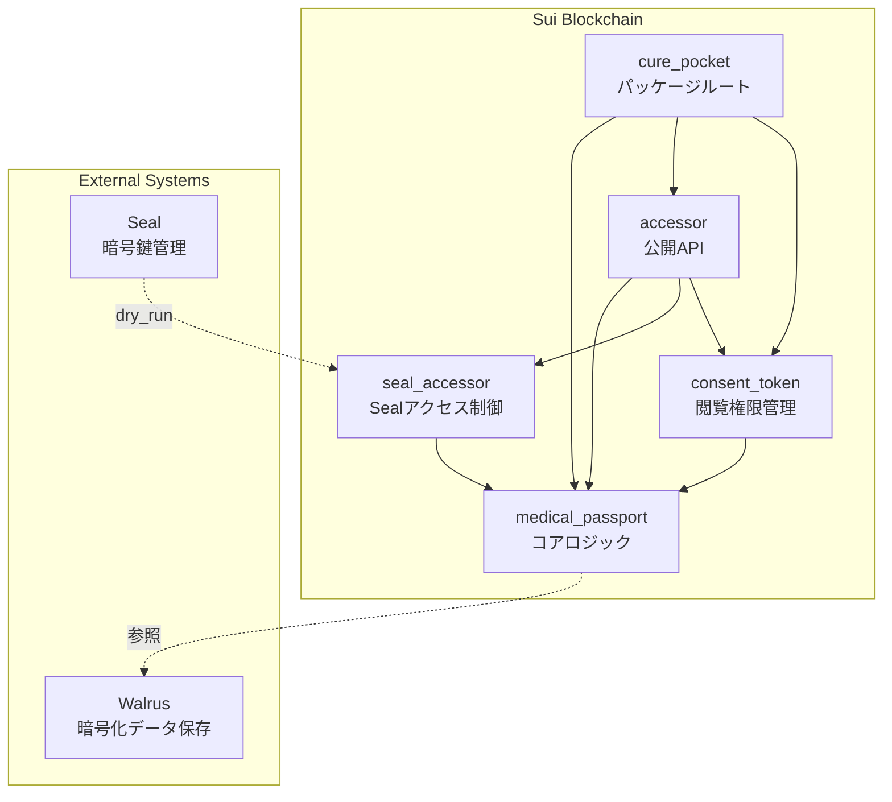

# Cure Pocket - Medical Passport Contract 要件定義書

---

## 目次

1. [概要](#1-概要)
2. [アーキテクチャ](#2-アーキテクチャ)
3. [データ構造仕様](#3-データ構造仕様)
4. [機能要件](#4-機能要件)
5. [非機能要件](#5-非機能要件)
6. [API仕様](#6-api仕様)
7. [エラーコード](#7-エラーコード)
8. [テスト要件](#8-テスト要件)
9. [付録](#9-付録)

---

## 1. 概要

### 1.1 ビジョン

Cure Pocketは、**世界中どこでも使える個人用ヘルスパスポートシステム**です。薬・検査値・画像・病歴などの医療情報を暗号化してWalrusに保存し、Sui上のSBT（Soulbound Token）で所有権を管理する分散型ヘルスデータ基盤を提供します。

### 1.2 技術スタック

| レイヤー | 技術 | 用途 |
|---------|------|------|
| **ブロックチェーン** | Sui（Move言語） | 所有権管理、アクセス制御 |
| **ストレージ** | Walrus | 暗号化医療データ保存 |
| **暗号化** | Seal | 暗号鍵管理、アクセス制御 |
| **フロントエンド** | Next.js 16 + TypeScript | ユーザーインターフェース |

### 1.3 主要特性

- **Soulbound（譲渡不可）**: パスポートは発行後、譲渡できない
- **1ウォレット1枚制約**: 1つのウォレットアドレスに対して1枚のみ
- **プライバシー保護**: 医療データはオフチェーン暗号化保存
- **グローバル対応**: 国際標準準拠（ISO 3166-1 alpha-2）
- **統計提供の明示同意**: パスポートに`analytics_opt_in`フラグを保持
- **柔軟なデータ参照**: Dynamic Fieldsで医療データをカテゴリー別に管理
- **時限付きアクセス制御**: ConsentTokenによる閲覧権限管理

---

## 2. アーキテクチャ

### 2.1 モジュール構成



### 2.2 モジュール責務

| モジュール | ファイル | 責務 | 可視性スコープ |
|-----------|---------|------|---------------|
| **cure_pocket** | `cure_pocket.move` | パッケージ初期化、PassportRegistry管理 | パッケージルート |
| **medical_passport** | `medical_passport.move` | コアロジック、データ構造定義 | 内部実装（`public(package)`） |
| **accessor** | `accessor.move` | 公開API（mint、getter、データ操作、Sealアクセス制御） | 外部インターフェース（`public`、`entry`） |
| **consent_token** | `consent_token.move` | 閲覧権限管理（ConsentToken） | 内部実装（`public(package)`） |
| **seal_accessor** | `seal_accessor.move` | Sealアクセス制御ロジック | 内部実装（`public(package)`） |

### 2.3 設計原則（Move 2024準拠）

- すべての`public fun`と`entry fun`は`accessor.move`に集約
- 内部ロジックは各モジュールに集約し、`public(package)`スコープで管理
- `public(friend)`は使用しない（Move 2024非推奨）
- Soulbound特性は`has key`のみ（`has store`なし）で実現
- 1ウォレット1枚制約はPassportRegistry（共有オブジェクト）+ Dynamic Fieldsで管理

---

## 3. データ構造仕様

### 3.1 MedicalPassport（医療パスポートSBT）

```move
public struct MedicalPassport has key {
    id: object::UID,
    seal_id: String,
    country_code: String,
    analytics_opt_in: bool,
}
```

#### フィールド仕様

| フィールド | 型 | 説明 | 制約 |
|-----------|----|----|------|
| `id` | `object::UID` | Suiオブジェクト識別子 | 自動生成 |
| `seal_id` | `String` | Seal暗号化システムの鍵/ポリシーID | 非空文字列 |
| `country_code` | `String` | 発行国コード（ISO 3166-1 alpha-2） | 非空文字列（例: "JP", "US"） |
| `analytics_opt_in` | `bool` | 匿名統計データ提供可否フラグ | 必須（true/false） |

#### Soulbound特性

- `has key`のみ（`has store`なし）により譲渡不可
- `transfer_to()`は`public(package)`スコープで外部呼び出し不可
- mint後は所有者以外に譲渡できない

#### 1ウォレット1枚制約

- PassportRegistry（共有オブジェクト）で管理
- Dynamic Fieldsで`address -> object::ID`マッピング
- mint時に既存チェック、登録時に二重mint防止

---

### 3.2 PassportRegistry（1ウォレット1枚制約管理）

```move
public struct PassportRegistry has key {
    id: object::UID,
}
```

#### 役割

- **共有オブジェクト**として1つだけ存在
- Dynamic Fieldsで`address -> object::ID`の対応を管理
- すべてのmint操作は`&mut PassportRegistry`を受け取る
- `address -> object::ID`マッピングにより、特定のパスポートの所有者を確認可能

#### Dynamic Fields設計

```
PassportRegistry.id (UID)
  |-- [address1] -> object::ID (passport_id_1)
  |-- [address2] -> object::ID (passport_id_2)
  +-- [address3] -> object::ID (passport_id_3)
```

---

### 3.3 医療データ参照（Dynamic Fields）

MedicalPassport本体は基本情報のみを保持し、医療データ本体はパスポート配下のDynamic Fieldsで管理します。

**データ種別管理**:
```
MedicalPassport.id (UID)
  |-- "medication" -> vector<String> (Walrus Blob IDリスト)
  |-- "lab" -> vector<String>
  |-- "imaging" -> vector<String>
  +-- "history" -> vector<String>
```

**設計の利点**:
- データ種別ごとに複数のBlob IDを柔軟に追加・更新できる
- Sealによる暗号/復号はデータ種別単位で実行
- フロントエンドは種別を指定して対応するBlobを取得・復号

---

### 3.4 ConsentToken（閲覧権限管理）

```move
public struct ConsentToken has key, store {
    id: object::UID,
    passport_id: object::ID,
    grantor: address,
    secret_hash: vector<u8>,
    scopes: vector<String>,
    expiration_ms: u64,
    is_active: bool,
}
```

#### フィールド仕様

| フィールド | 型 | 説明 |
|-----------|----|----|
| `id` | `object::UID` | トークン識別子 |
| `passport_id` | `object::ID` | 対象パスポートID |
| `grantor` | `address` | 付与者（パスポート所有者） |
| `secret_hash` | `vector<u8>` | 合言葉のハッシュ（sha3_256） |
| `scopes` | `vector<String>` | アクセス可能なデータ種別 |
| `expiration_ms` | `u64` | 有効期限（Unix timestamp, ミリ秒） |
| `is_active` | `bool` | 有効フラグ（true=有効、false=無効化済み） |

#### アクセス制御方式: ハッシュロック

- **合言葉（secret）**: パスポート所有者が医療機関に共有する秘密情報
- **ハッシュロック**: `secret_hash`にsecretのSHA3-256ハッシュを保存
- **検証**: Sealキーサーバーが復号リクエスト時に、生secretをハッシュ化して`secret_hash`と比較
- **利点**: 合言葉を知っている者のみがアクセス可能（柔軟性が高い）
- **注意**: 被付与者の明示的な指定がないため、secretを知っている人なら誰でもアクセス可能

#### 機能概要

1. **トークン作成**: パスポート所有者が合言葉を設定して閲覧権を付与
2. **トークン検証**: Sealキーサーバーが復号リクエスト時に合言葉をハッシュ化して検証
3. **トークン無効化**: パスポート所有者が`is_active`をfalseに設定して権限を取り消し
4. **スコープ検証**: データ種別ごとのアクセス制御

---

## 4. 機能要件

### FR-1: パスポート発行（Mint）

**優先度**: Critical

#### 概要

ユーザーが自身の医療パスポートSBTを発行できる機能。

#### 詳細要件

- **FR-1.1**: 誰でもセルフmintできる
- **FR-1.2**: 1ウォレット1枚まで（二重mint禁止）
- **FR-1.3**: 必須フィールド: `seal_id`、`country_code`（非空文字列）と `analytics_opt_in`（bool）
- **FR-1.4**: mint後のパスポートはSoulbound（譲渡不可）
- **FR-1.5**: mint後のパスポートはユーザーアドレスに自動転送

#### 受け入れ基準

- ユーザーは1回のみmint可能
- 二重mintは`E_ALREADY_HAS_PASSPORT`でabort
- 空文字列は`E_EMPTY_*`でabort
- mint後のパスポートは譲渡不可
- mint後のパスポートはユーザー所有

---

### FR-2: Dynamic Fields操作（医療データ参照管理）

**優先度**: Critical

#### 概要

パスポート配下のDynamic Fieldsで医療データのWalrus Blob IDを管理する機能。

#### 詳細要件

- **FR-2.1**: データエントリの追加（`add_data_entry`）
  - 指定したデータ種別にBlob IDを追加
  - 既存のBlob IDリストに追加される

- **FR-2.2**: データエントリの置換（`replace_data_entry`）
  - 指定したデータ種別のBlob IDリスト全体を置換

- **FR-2.3**: データエントリの取得（`get_data_entry`）
  - 指定したデータ種別のBlob IDリストを取得

- **FR-2.4**: データエントリの削除（`remove_data_entry`）
  - 指定したデータ種別のDynamic Fieldを削除

#### 受け入れ基準

- データ種別とBlob IDは非空文字列
- パスポート所有者のみが操作可能
- 存在しないデータ種別の取得は空ベクタを返す

---

### FR-3: ConsentToken管理（閲覧権限管理）

**優先度**: High

#### 概要

パスポート所有者が医療機関に対して閲覧権限を付与・管理する機能。

#### 詳細要件

- **FR-3.1**: トークン作成（`create_consent_token`）
  - パスポート所有者のみが作成可能（所有者検証あり）
  - 合言葉のハッシュ（secret_hash）、スコープ（データ種別リスト）、有効期限を指定
  - 作成時に有効期限を計算（現在時刻 + duration_ms）
  - 作成されたトークンは共有オブジェクトとして公開

- **FR-3.2**: トークン検証（`seal_approve_consent`）
  - 有効フラグチェック（is_active == true）
  - 有効期限チェック（現在時刻 < expiration_ms）
  - パスポートID一致チェック（Payload、Token、passport引数の3つが一致）
  - ハッシュロック検証（Payloadのsecretをハッシュ化して`secret_hash`と比較）
  - スコープ検証（data_typeがscopesに含まれるか）
  - data_typeとPayload内のrequested_scopeの一致確認

- **FR-3.3**: トークン無効化（`revoke_consent_token`）
  - 付与者（grantor）のみが無効化可能
  - `is_active`フラグをfalseに設定

#### 受け入れ基準

- パスポート所有者以外はトークン作成不可（`E_NOT_PASSPORT_OWNER`）
- 期限切れトークンは検証失敗（`E_CONSENT_EXPIRED`）
- 無効化済みトークンは検証失敗（`E_CONSENT_REVOKED`）
- パスポートID不一致は検証失敗（`E_INVALID_PASSPORT_ID`）
- 合言葉不一致は検証失敗（`E_INVALID_SECRET`）
- data_type不一致は検証失敗（`E_DATA_TYPE_MISMATCH`）
- スコープ外のデータ種別は検証失敗（`E_SCOPE_NOT_ALLOWED`）

---

### FR-4: Sealアクセス制御

**優先度**: Critical

#### 概要

Sealキーサーバーからの復号リクエストに対するアクセス制御機能。

#### 詳細要件

- **FR-4.1**: 患者本人の復号（`seal_approve_patient_only`）
  - パスポート所有者のみが自分のデータを復号可能
  - PassportRegistryの`address -> object::ID`マッピングで所有権検証
  - Sealキーサーバーが`.dry_run_transaction_block`で実行

- **FR-4.2**: ConsentTokenベースの復号（`seal_approve_consent`）
  - ConsentTokenの有効性を検証（FR-3.2の検証ロジック）
  - スコープ検証（データ種別の一致確認）
  - 検証通過で復号鍵を提供

#### 受け入れ基準

- パスポート所有者以外からのリクエストは拒否（`E_NO_ACCESS`）
- ConsentToken検証失敗時は適切なエラーでabort
- Sealキーサーバーは`.dry_run_transaction_block`で検証可能

---

### FR-5: パスポート照会（Getter）

**優先度**: High

#### 概要

パスポートのフィールド情報を照会できる機能。

#### 詳細要件

- **FR-5.1**: 個別フィールド取得（`seal_id`, `country_code`, `analytics_opt_in`）
- **FR-5.2**: 一括フィールド取得（`get_all_fields`）
- **FR-5.3**: 所有状態確認（`has_passport`）
- **FR-5.4**: すべてのgetter関数はimmutable参照で動作

#### 受け入れ基準

- getter関数はパスポートの状態を変更しない
- `has_passport`は正確な所有状態を返す
- 参照のライフタイムが適切に管理される

---

## 5. 非機能要件

### NFR-1: セキュリティ

**優先度**: Critical

#### 詳細要件

- **NFR-1.1**: Soulbound特性（パスポートは譲渡不可）
- **NFR-1.2**: 1ウォレット1枚制約（PassportRegistryで管理）
- **NFR-1.3**: バリデーション（非空文字列チェック）
- **NFR-1.4**: Sealアクセス制御（所有者またはConsentToken検証）

#### 実装方法

| 要件 | 実装方法 |
|------|---------|
| Soulbound | `has store`なし、`transfer_to()`は`public(package)` |
| 1ウォレット1枚 | PassportRegistry + Dynamic Fields + 共有オブジェクト |
| バリデーション | `create_passport_internal()`で非空チェック |
| アクセス制御 | `seal_approve_*`関数で検証 |

---

### NFR-2: データ整合性

**優先度**: Critical

#### 詳細要件

- **NFR-2.1**: すべてのフィールドは非空文字列（seal_id, country_code, data_type, blob_id）
- **NFR-2.2**: PassportRegistryは共有オブジェクト（競合防止）
- **NFR-2.3**: イベント発行による追跡可能性（ConsentToken作成・無効化など）

---

### NFR-3: Move 2024準拠

**優先度**: High

#### 詳細要件

- **NFR-3.1**: 可視性ルール遵守（`public`, `public(package)`, `entry`）
- **NFR-3.2**: ファイルベース関数配置（AGENTS.md準拠）
- **NFR-3.3**: `public(friend)`非使用（Move 2024非推奨）

---

## 6. API仕様

### 6.1 Public API（accessor.move）

#### mint_medical_passport（エントリー関数）

```move
entry fun mint_medical_passport(
    registry: &mut PassportRegistry,
    seal_id: String,
    country_code: String,
    analytics_opt_in: bool,
    ctx: &mut tx_context::TxContext
)
```

- 誰でも呼び出し可能（セルフmint）
- 1ウォレット1枚まで
- エラー: `E_ALREADY_HAS_PASSPORT (3)`, `E_EMPTY_SEAL_ID (1)`, `E_EMPTY_COUNTRY_CODE (2)`

---

#### Getter関数群

```move
public fun get_seal_id(passport: &MedicalPassport): &String
public fun get_country_code(passport: &MedicalPassport): &String
public fun get_analytics_opt_in(passport: &MedicalPassport): bool
public fun get_all_fields(passport: &MedicalPassport): (&String, &String, bool)
public fun has_passport(registry: &PassportRegistry, owner: address): bool
```

---

#### Dynamic Fields操作

```move
entry fun add_data_entry(
    passport: &mut MedicalPassport,
    data_type: String,
    blob_ids: vector<String>
)

entry fun replace_data_entry(
    passport: &mut MedicalPassport,
    data_type: String,
    blob_ids: vector<String>
)

public fun get_data_entry(
    passport: &MedicalPassport,
    data_type: String
): &vector<String>

entry fun remove_data_entry(
    passport: &mut MedicalPassport,
    data_type: String
): vector<String>
```

- `add_data_entry`: データ種別に対してBlob IDリストを新規追加
- `replace_data_entry`: データ種別のBlob IDリスト全体を置換
- `get_data_entry`: データ種別のBlob IDリストを取得（参照を返す）
- `remove_data_entry`: データ種別のBlob IDリストを削除し、値を返す
- エラー: `E_EMPTY_DATA_TYPE_KEY (9)`, `E_EMPTY_BLOB_IDS (10)`, `E_DATA_ENTRY_ALREADY_EXISTS (11)`, `E_DATA_ENTRY_NOT_FOUND (12)`

---

#### Sealアクセス制御

```move
entry fun seal_approve_patient_only(
    passport: &MedicalPassport,
    registry: &PassportRegistry,
    ctx: &tx_context::TxContext
)
```

- Sealキーサーバーが`.dry_run_transaction_block`で実行
- パスポート所有者のみアクセス許可
- エラー: `E_NO_ACCESS (102)`

---

#### ConsentToken操作

```move
entry fun create_consent_token(
    passport: &MedicalPassport,
    registry: &PassportRegistry,
    secret_hash: vector<u8>,
    scopes: vector<String>,
    duration_ms: u64,
    clock: &Clock,
    ctx: &mut tx_context::TxContext
)

entry fun seal_approve_consent(
    id: vector<u8>,
    token: &ConsentToken,
    passport: &MedicalPassport,
    data_type: String,
    clock: &Clock
)

entry fun revoke_consent_token(
    token: &mut ConsentToken,
    ctx: &tx_context::TxContext
)
```

---

## 7. エラーコード

### MedicalPassport関連

| コード | 定数名 | 説明 | 対処方法 |
|-------|--------|------|---------|
| **1** | `E_EMPTY_SEAL_ID` | Seal IDが空文字列 | 有効なseal IDを指定 |
| **2** | `E_EMPTY_COUNTRY_CODE` | 国コードが空文字列 | 有効な国コード（例: "JP"）を指定 |
| **3** | `E_ALREADY_HAS_PASSPORT` | 既にパスポートを所持している | 既存パスポートを使用 |
| **4** | `E_MIGRATION_TARGET_HAS_PASSPORT` | 移行先が既にパスポート所持 | 別のアドレスに移行 |
| **6** | `E_REGISTRY_ALREADY_REGISTERED` | レジストリに既に登録済み | 既存の登録情報を使用 |
| **7** | `E_REGISTRY_NOT_FOUND` | レジストリに登録が見つからない | パスポートを作成 |
| **8** | `E_NOT_OWNER_FOR_MIGRATION` | 移行元の所有者ではない | 所有者のみが移行可能 |
| **9** | `E_EMPTY_DATA_TYPE_KEY` | データ種別キーが空文字列 | 有効なデータ種別を指定 |
| **10** | `E_EMPTY_BLOB_IDS` | Blob IDリストが空 | 有効なBlob IDを指定 |
| **11** | `E_DATA_ENTRY_ALREADY_EXISTS` | データエントリが既に存在 | `replace_data_entry`を使用 |
| **12** | `E_DATA_ENTRY_NOT_FOUND` | データエントリが見つからない | 存在するデータ種別を指定 |

### SealAccessor関連

| コード | 定数名 | 説明 | 対処方法 |
|-------|--------|------|---------|
| **102** | `E_NO_ACCESS` | アクセス拒否（Sealアクセス制御） | パスポート所有者のみが復号リクエスト可能 |

### ConsentToken関連

| コード | 定数名 | 説明 | 対処方法 |
|-------|--------|------|---------|
| **201** | `E_CONSENT_REVOKED` | ConsentTokenが無効化済み | 新しいトークンを作成 |
| **202** | `E_CONSENT_EXPIRED` | ConsentTokenが期限切れ | 新しいトークンを作成 |
| **203** | `E_INVALID_PASSPORT_ID` | パスポートIDが不一致 | 正しいパスポートを指定 |
| **204** | `E_INVALID_SECRET` | シークレットハッシュが不一致 | 正しいシークレットを使用 |
| **205** | `E_EMPTY_SECRET` | シークレットが空 | 有効なシークレットを指定 |
| **206** | `E_INVALID_DURATION` | 無効な期間指定 | 適切な期間を指定 |
| **207** | `E_EMPTY_SCOPES` | スコープリストが空 | 有効なスコープを指定 |
| **208** | `E_EXPIRATION_OVERFLOW` | 有効期限計算時のオーバーフロー | 適切な期間を指定 |
| **209** | `E_SCOPE_NOT_ALLOWED` | スコープ不一致 | 許可されたデータ種別を指定 |
| **210** | `E_NON_GRANTOR_REVOKE` | grantor以外による無効化試行 | grantor（付与者）のみ無効化可能 |
| **211** | `E_NOT_PASSPORT_OWNER` | パスポート所有者ではない | 所有者のみがトークン作成可能 |
| **212** | `E_DATA_TYPE_MISMATCH` | データ種別が不一致 | 正しいデータ種別を指定 |

---

## 8. テスト要件

### 8.1 基本機能テスト

| テストケース | 検証内容 |
|-------------|---------|
| **TEST-1** | PassportRegistry初期化 |
| **TEST-2** | MedicalPassport作成時のフィールド設定 |
| **TEST-3** | mint_medical_passportの基本動作 |
| **TEST-4** | 全フィールド一括取得（get_all_fields） |

### 8.2 異常系テスト

| テストケース | 検証内容 | 期待エラー |
|-------------|---------|-----------|
| **TEST-5** | 空seal_id | abort code 1 |
| **TEST-6** | 空country_code | abort code 2 |
| **TEST-7** | 二重mint | abort code 3 |

### 8.3 Dynamic Fieldsテスト

| テストケース | 検証内容 |
|-------------|---------|
| **TEST-8** | データエントリの追加 |
| **TEST-9** | データエントリの取得 |
| **TEST-10** | データエントリの置換 |
| **TEST-11** | データエントリの削除 |
| **TEST-12** | 空データ種別でエラー |
| **TEST-13** | 空Blob IDでエラー |

### 8.4 Sealアクセス制御テスト

| テストケース | 検証内容 | 期待結果 |
|-------------|---------|---------|
| **TEST-14** | パスポート所有者が復号リクエスト | 成功 |
| **TEST-15** | 所有者以外が復号リクエスト | abort code 102 |
| **TEST-16** | 複数ユーザーの所有権検証 | 各自のパスポートのみアクセス可 |

### 8.5 ConsentTokenテスト

| テストケース | 検証内容 | 期待結果 |
|-------------|---------|---------|
| **TEST-17** | トークン作成 | 成功 |
| **TEST-18** | 所有者以外がトークン作成 | abort code 207 |
| **TEST-19** | トークン検証（有効期限内） | 成功 |
| **TEST-20** | トークン検証（期限切れ） | abort code 203 |
| **TEST-21** | トークン検証（無効化済み） | abort code 204 |
| **TEST-22** | トークン無効化 | 成功 |
| **TEST-23** | スコープ検証（許可済みデータ種別） | 成功 |
| **TEST-24** | スコープ検証（未許可データ種別） | abort code 209 |

---

## 9. 付録

### 9.1 用語集

| 用語 | 説明 |
|------|------|
| **SBT** | Soulbound Token（譲渡不可トークン） |
| **Walrus** | 分散型ストレージシステム |
| **Seal** | 暗号鍵管理システム |
| **PassportRegistry** | パスポート所有状態を管理する共有オブジェクト |
| **Dynamic Fields** | Suiの動的フィールド機能 |
| **ConsentToken** | 閲覧権限を表すトークン |
| **PTB** | Programmable Transaction Block（Suiのトランザクション） |

---

### 9.2 参考リンク

- [Sui Documentation](https://docs.sui.io/)
- [Move Language](https://move-language.github.io/move/)
- [Walrus](https://docs.walrus.site/)
- [Seal](https://seal-docs.wal.app/)
- [AGENTS.md](../AGENTS.md)（Move 2024準拠設計ガイド）

---

**この要件定義書は「生きたドキュメント」です。実装過程で必要に応じて更新してください。**
